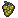

# Idol-Natsumi
Manage the daily life and artistic career of Natsumi Hasegawa, an aspiring Japanese idol from a small town.

## Presentation

*Idol Natsumi* is a Tamagotchi like game, with a short game loop, simple mechanics, that can be played on-the-go. The player has to be able to progress in the game even by just playing it for 5 minutes.

In *Idol Natsumi*, the player takes care of and raises a Japanese girl named Natsumi Hasegawa from age 11 to age 21. Her goal in life is to become a popular singer in Japan.

## Core mechanics

### General navigation

* **TAB** key open or closes the main menu
* **ESCAPE** key goes back to Home screen
* **ENTER** key validates whatever option is selected
* **UP/DOWN** Navigate menus

### The 4 stages of Natsumi's life

* Between 11 years old and 13 years old: preteen - No access to Restaurant, Order and Competition
* Between 13 years old and 15 years old: teenager phase 1 - Gains access to Order and local Competition
* Between 15 and 18 years old: teenager phase 2 - All limits are lifted
* Between 18 and 21 years old: young adult

Age progression is automatic, Natsumi ages one year every 24 hours.

### Statistics

Stat caps: 0 is the lowest while 4 is the highest.

* **Hunger** (integer; 0 to 4; indicates how hungry Natsumi is)
* **Hygiene** (integer; 0 to 4; indicates how clean Natsumi is)
* **Energy** (integer; 0 to 4; indicates how energized Natsumi is)
* **Spirit** (integer; 0 to 4; indicates the general mood of Natsumi)
* **Popularity** (integer; 0 to 4; indicates how popular Natsumi is)
* **Performance** (integer; 0 to 4; shows how good of an entertainer Natsumi is)
* **Fitness** (integer; 0 to 4; indicates how healthy Natsumi is)
* **Culture** (integer; 0 to 4; indicates how knowledgeable Natsumi is)
* **Charm** (integer; 0 to 4; shows how well-mannered and likeable Natsumi is)

| STAT          | TYPE       | RANGE | UP (activities or events that raise it)                                   | DOWN (causes that lower it)                                      |
|----------------|------------|--------|----------------------------------------------------------------------------|------------------------------------------------------------------|
| **Age**        | Passive    | 0–∞    | Increases automatically every `agingInterval` ms                          | —                                                                |
| **Hunger**     | Passive    | 0–4    | COOK, RESTAURANT, ORDER                                                   | Decreases by 1 every `hungerInterval` ms                         |
| **Hygiene**    | Passive    | 0–4    | WASH, ONSEN                                                               | Decreases by 1 every `hygieneInterval` ms                        |
| **Energy**     | Passive    | 0–4    | GARDEN, TEMPLE, ONSEN, NAP, BEDTIME                                       | Decreases by 1 every `energyInterval` ms                         |
| **Spirit**     | Derived    | 0–4    | Improves when Hygiene, Energy, Hunger, Performance, or Popularity are high or through meditation | Declines when those stats are low                                |
| **Popularity** | Active     | 0–4    | COMPETITION (LOCAL, DEPARTMENTAL, REGIONAL, NATIONAL)                     | —                                                                |
| **Performance**| Active     | 0–4    | TRAINING → SING, DANCE                                                   | —                                                                |
| **Fitness**    | Passive    | 0–4    | TRAINING → SWIM, GYM, RUN                                               | Decreases by 1 every time Age increases by 1 year                |
| **Culture**    | Active     | 0–4    | TRAINING → LIBRARY                                                      | —                                                                |
| **Charm**      | Active     | 0–4    | FOOD → COOK, RESTAURANT, ORDER                                           | —                                                                |

### Keep Natsumi fed

#### Eat at home

| FOOD            | ICON      |
|-----------------|-----------|
| Red apple       |  |
| Green apple       |  |
| Avocado       |  |
| Bread       |  |
| Banana       |  |
| Broccoli       |  |
| Sweets       |  |
| Carrot       |  |
| Meat       |  |
| Coconut       |  |
| Coconut juice       |  |
| Coffee       |  |
| Biscuits       |  |
| Corn       |  |
| Croissant       |  |
| Fried egg       |  |
| Grapes       |  |
| Kiwi       |  |
| Milk       |  |
| Orange       |  |
| Peach       |  |
| Pear       |  |
| Strawberries       |  |
| Maki       |  |
| Sushi       |  |
| Watermelon       |  |

#### Go to the restaurant

| FOOD                    | PRICE |
|-------------------------|-------|
| Tofu vegetable Teishoku | $700  |
| Grilled salmon Teishoku | $800  |
| Fried chicken Teishoku  | $900  |

#### Order takeaway food

| FOOD                    | PRICE |
|-------------------------|-------|
| Cheap bento             | $600  |
| Healthy salad           | $750  |
| Deluxe Teishoku         | $1200 |

#### Shop at the local conbini ("ConbiMart")

| FOOD                    | PRICE |
|-------------------------|-------|
| Salmon & mayo Onigiri   | $150  |
| Instant ramen           | $180  |
| Egg sandwich            | $240  |
| Lucky Custard Cup       | $220  |
| Green tea soda          | $130  |

### Compete

#### Start locally

Face off against neighborhood talents at the Shiodome Ward Community Hall, singing in front of roughly 30 people and a jury featuring… the owner of the town’s best karaoke bar!
Everybody starts somewhere.

#### Move on to the departmental stage

Level up and head to the Hanamori City Hall Auditorium, where you finally step onto a real stage with semi-professional lighting.
This time, the jury includes a few retired ex-Idols with sharp ears and even sharper eyebrows.

#### Reach the regional competition

Now it’s getting serious. Enter Osaka Minami Art Center - Stage B and perform like a seasoned pro.
The audience is bigger, the lights brighter, and every note counts.

#### Claim the national spotlight

Step into the Tokyo Grand Dome Hall, compete against Japan’s top young singers and, if you’re good enough sing alongside Minami Toshida herself.

### Train

#### Singing

In this mini game, improve your Performance level by catching music coins falling from the sky before they hit the ground. Use the LEFT and RIGHT arrow keys to move horizontally and make sure you drop as few music coins as possible.

#### Dancing

Help Natsumi get ready to become a good dancer with this mini game in which you must press the LEFT, RIGHT, UP or DOWN arrow keys according to what's displayed on the screen. Get it right 30 times to increase your Performance level.

#### Swimming

Go to the local swimming pool and avoid 30 sharks to increase your Fitness. Yes, sharks.

#### Gym

Hit the gym to increase your Fitness. This mini game will test your skills and reflexes, so warm up and go for it!

#### Run

Go for a run in the forest and increase your Fitness.

