# Idol-Natsumi
Manage the daily life and artistic career of Natsumi Hasegawa, an aspiring Japanese idol from a small town.

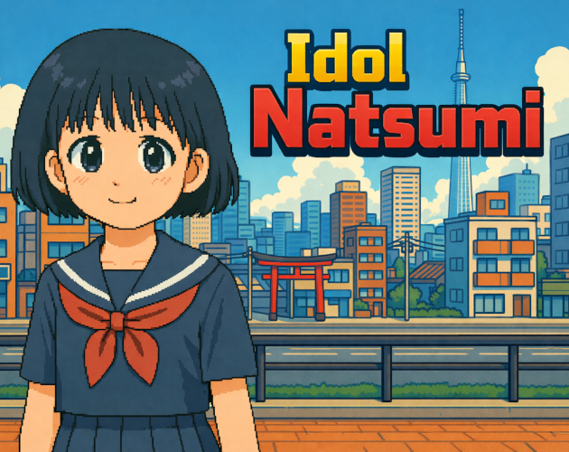

## Table of contents

- [Presentation](#presentation)
- [Core mechanics](#core-mechanics)
  - [General navigation](#general-navigation)
    - [Home screen](#home-screen)
    - [Status board](#status-board)
    - [Inventory](#inventory)
    - [Cards collection viewer](#cards-collection-viewer)
  - [Game progression](#game-progression)
  - [Statistics](#statistics)
  - [Keep Natsumi fed](#keep-natsumi-fed)
    - [Eat at home](#eat-at-home)
    - [Go to the restaurant](#go-to-the-restaurant)
    - [Order takeaway food](#order-takeaway-food)
    - [Shop at the local conbini ("ConbiMart")](#shop-at-the-local-conbini-conbimart)
  - [Compete](#compete)
    - [Start locally](#start-locally)
    - [Move on to the departmental stage](#move-on-to-the-departmental-stage)
    - [Reach the regional competition](#reach-the-regional-competition)
    - [Claim the national spotlight](#claim-the-national-spotlight)
  - [Train](#train)
    - [Singing](#singing)
    - [Dancing](#dancing)
    - [Swimming](#swimming)
    - [Gym](#gym)
    - [Run](#run)
  - [Go to the temple](#go-to-the-temple)
  - [Do gardening](#do-gardening)

## Presentation

*Idol Natsumi* is a Tamagotchi like game, with a short game loop, simple mechanics, that can be played on-the-go. The player has to be able to progress in the game even by just playing it for 5 minutes.

In *Idol Natsumi*, the player takes care of and raises a Japanese girl named Natsumi Hasegawa from age 11 to age 21. Her goal in life is to become a popular singer in Japan.

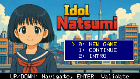

## Core mechanics

### General navigation

* **TAB** opens or closes the main menu
* **ESCAPE** goes back to Home screen
* **ENTER** validates selected option
* **UP/DOWN** Navigate menus

#### Home screen

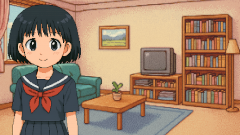

Idol Natsumi is meant to be easy to navigate using a few keys; most of the time you have two options: the slow way, using TAB to open a menu, then UP/DOWN to pick the option you want and finally press ENTER to confirm, or the fast way, simply press one of the number keys to quickly access the feature you're after.

The fast keys are as follows:

|  KEY  |  FUNCTION  |
|-------|----------|
| 0 | Open Status board |
| 1 | Open Inventory |
| 2 | Open Food menu |
| 3 | Open Training menu |
| 4 | Open Competition menu |
| 5 | Open Health menu |
| 6 | Open Rest menu |
| 7 | Go to the garden |
| 8 | Open Events menu |
| 9 | Looks at your cards collection |

If you end up somewhere you don't want to be, simply press the ESC key to go back to the Home screen.

#### Status board

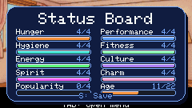

Press 0 from the Home screen to access it.

It shows Natsumi's statistics as well as her age. It refreshes whenever a stat is updated, so you can leave it open if you feel like idling for a bit while keeping an eye on your little *protégé*.

Pressing S on that screen saves the game.

#### Inventory

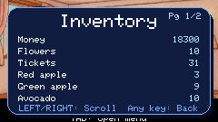

Press 1 from the Home screen to access it.

It shows how many flowers, tickets and food items Natsumi currently have. The amount of money in her purse is also displayed. Press LEFT/RIGHT to go from one page to another.

#### Cards collection viewer

Press 9 from the Home screen to access it.

Matsuri tickets grant you access to the local Matsuri festival where you can play the Garapon lottery game and win beautiful illustrated cards. The Cards collection viewer allows you to browse your collection: Press LEFT/RIGHT to go from one card to another, press SPACE to hide or show the legend.

### Game progression

* Age progression is automatic,
* Natsumi ages one year every 24 hours,
* Here is how progression goes for Competition:

|  LEVEL (natsumi.competition)  |  STATUS  |
|-------|----------|
| 0 | Not started, all Competitions are locked |
| 1 | 1x perfect Training achieved (any category) |
| 2 | 2x perfect Training |
| 3 | 3x perfect Training -> Local competition unlocked |
| 4 | Local competition completed (local champion) |
| 5 | 1x perfect Training |
| 6 | 2x perfect Training |
| 7 | 3x perfect Training -> Departmental competition unlocked |
| 8 | Departmental competition completed (departmental champion) |
| 9 | 1x perfect Training |
| 10 | 2x perfect Training |
| 11 | 3x perfect Training -> Regional competition unlocked |
| 12 | Regional competition completed (regional champion) |
| 13 | 1x perfect Training |
| 14 | 2x perfect Training |
| 15 | 3x perfect Training -> National competition unlocked |
| 16 | National competition completed (national champion) |

* Natsumi must be in very good shape before entering any competition,
* That's why Hunger, Hygiene, Energy, Performance, Fitness, Culture and Charm must be at 4 (their maximum),
* Should any stat drop below 4 at any time, competition will be locked.

### Statistics

Stat caps: 0 is the lowest while 4 is the highest.

* **Hunger** (integer; 0 to 4; indicates how hungry Natsumi is)
* **Hygiene** (integer; 0 to 4; indicates how clean Natsumi is)
* **Energy** (integer; 0 to 4; indicates how energized Natsumi is)
* **Spirit** (integer; 0 to 4; indicates the general mood of Natsumi)
* **Popularity** (integer; 0 to 4; indicates how popular Natsumi is)
* **Performance** (integer; 0 to 4; shows how good of an entertainer Natsumi is)
* **Fitness** (integer; 0 to 4; indicates how healthy Natsumi is)
* **Culture** (integer; 0 to 4; indicates how knowledgeable Natsumi is)
* **Charm** (integer; 0 to 4; shows how well-mannered and likeable Natsumi is)

| STAT          | TYPE       | RANGE | UP (activities or events that raise it)                                   | DOWN (causes that lower it)                                      |
|----------------|------------|--------|----------------------------------------------------------------------------|------------------------------------------------------------------|
| **Age**        | Passive    | 0–∞    | Increases automatically every `agingInterval` ms                          | —                                                                |
| **Hunger**     | Passive    | 0–4    | COOK, RESTAURANT, ORDER                                                   | Decreases by 1 every `hungerInterval` ms                         |
| **Hygiene**    | Passive    | 0–4    | WASH, ONSEN                                                               | Decreases by 1 every `hygieneInterval` ms                        |
| **Energy**     | Passive    | 0–4    | GARDEN, TEMPLE, ONSEN, NAP, BEDTIME                                       | Decreases by 1 every `energyInterval` ms                         |
| **Spirit**     | Derived    | 0–4    | Improves when Hygiene, Energy, Hunger, Performance, or Popularity are high or through meditation | Declines when those stats are low                                |
| **Popularity** | Active     | 0–4    | COMPETITION (LOCAL, DEPARTMENTAL, REGIONAL, NATIONAL)                     | —                                                                |
| **Performance**| Active     | 0–4    | TRAINING → SING, DANCE                                                   | —                                                                |
| **Fitness**    | Passive    | 0–4    | TRAINING → SWIM, GYM, RUN                                               | Decreases by 1 every time Age increases by 1 year                |
| **Culture**    | Active     | 0–4    | TRAINING → LIBRARY, MARKET                                                      | —                                                                |
| **Charm**      | Active     | 0–4    | FOOD → COOK, RESTAURANT, ORDER, MARKET                                           | —                                                                |

### Keep Natsumi fed

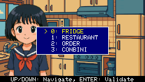

#### Eat at home

| FOOD            | ICON      |
|-----------------|-----------|
| Red apple       |  |
| Green apple       |  |
| Avocado       |  |
| Bread       |  |
| Banana       |  |
| Broccoli       |  |
| Sweets       |  |
| Carrot       |  |
| Meat       |  |
| Coconut       |  |
| Coconut juice       |  |
| Coffee       |  |
| Biscuits       |  |
| Corn       |  |
| Croissant       |  |
| Fried egg       |  |
| Grapes       | 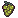 |
| Kiwi       |  |
| Milk       |  |
| Orange       |  |
| Peach       |  |
| Pear       | 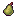 |
| Strawberries       |  |
| Maki       |  |
| Sushi       |  |
| Watermelon       |  |

#### Go to the restaurant

| FOOD                    | PRICE |
|-------------------------|-------|
| Tofu vegetable Teishoku | $700  |
| Grilled salmon Teishoku | $800  |
| Fried chicken Teishoku  | $900  |

#### Order takeaway food

Natsumi can use the Orderibi mobile app to get food delivered at home

| FOOD                    | PRICE |
|-------------------------|-------|
| Cheap bento             | $600  |
| Healthy salad           | $750  |
| Deluxe Teishoku         | $1200 |

#### Shop at the local conbini ("ConbiMart")

Natsumi can walk to her local combini to stock her fridge with vegetables, fruits and drinks.

### Compete

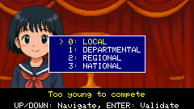

#### Start locally

Face off against neighborhood talents at the Shiodome Ward Community Hall, singing in front of roughly 30 people and a jury featuring… the owner of the town’s best karaoke bar!
Everybody starts somewhere.

#### Move on to the departmental stage

Level up and head to the Hanamori City Hall Auditorium, where you finally step onto a real stage with semi-professional lighting.
This time, the jury includes a few retired ex-Idols with sharp ears and even sharper eyebrows.

#### Reach the regional competition

Now it’s getting serious. Enter Osaka Minami Art Center - Stage B and perform like a seasoned pro.
The audience is bigger, the lights brighter, and every note counts.

#### Claim the national spotlight

Step into the Tokyo Grand Dome Hall, compete against Japan’s top young singers and, if you’re good enough sing alongside Minami Toshida herself.

### Train

#### Singing

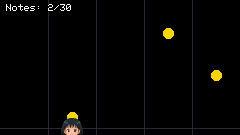
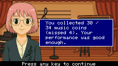

In this mini game, improve your Performance level by catching music coins falling from the sky before they hit the ground. Use the LEFT and RIGHT arrow keys to move horizontally and make sure you drop as few music coins as possible.

#### Dancing

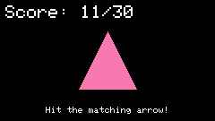
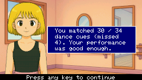

Help Natsumi get ready to become a good dancer with this mini game in which you must press the LEFT, RIGHT, UP or DOWN arrow keys according to what's displayed on the screen. Get it right 30 times to increase your Performance level.

#### Swimming

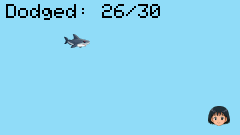
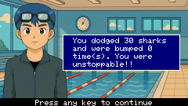

Go to the local swimming pool and avoid 30 sharks to increase your Fitness. Yes, sharks.

#### Gym

Hit the gym to increase your Fitness. This mini game will test your skills and reflexes, so warm up and go for it!

#### Run

Go for a run in the forest and increase your Fitness.

### Go to the temple

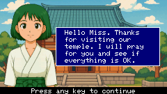

### Do gardening

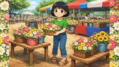
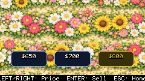
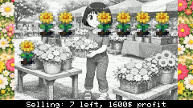
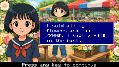

Natsumi can grow flowers and sell it to the local market.

## Menus

### STATS

Opens the [Status board](#status-board)

### INVENTORY

Opens the [Inventory](#inventory)

### FOOD

Gives access to the food menu.

#### FRIDGE

Open the fridge and pick one food item to eat.
Shortcut: 2, 0

#### RESTAURANT

Go to the restaurant; Natsumi must be at least 16.
Shortcut: 2, 1

#### ORDER

Order food using the *Orderibi* phone app.
Shortcut: 2, 2

#### CONBINI

Go to "Conbimart", the local convenience store (*conbini*).
Shortcut: 2, 3

### TRAINING

#### SING

Go to the singing school for a lesson. Catch 30 notes and you're good!
Shortcut: 3, 0

#### DANCE

Walk to the dance school and work on your moves. Get it right 30 times in a row to score a perfect training.
Shortcut: 3, 1

#### SWIM

Go to the swimming pool and dodge 30 sharks.
Shortcut: 3, 2

#### GYM

Go to the fitness club for a good workout. Wash the equipment once you're done.
Shortcut: 3, 3

#### RUN

Jogging is always good, especially early in the morning.
Shortcut: 3, 4

#### LIBRARY

It's not all about sport, the mind also needs exercise. Go to the local library to read a book.
Shortcut: 3, 5

#### MARKET

Natsumi sets up a flower stall at the local market; that's a very good way to make money fast. You need flowers though. Fortunately, you have a garden!
Shortcut: 3, 6

### COMPETITION

Access to competition is only possible when the following conditions are met:

* Hunger, Hygiene, Energy, Performance, Fitness, Culture and Charm must be at 4 (their maximum),
* The competition level you are trying to enter has been unlocked,
* Natsumi has to become the best version of herself by maxxing out her stats,
* She must also train a lot and be good at it, as 3 perfect (no miss) training sessions are required to unlock a competition level

Shortcuts:

* 4, 0 for local
* 4, 1 for departmental
* 4, 2 for regional
* 4, 3 for national

### HEALTH

#### WASH

Set the temperature of the shower right before Natsumi steps in.
Shortcut: 5, 0

#### DOCTOR

Send Natsumi to the doctor for a checkup; her general health will be checked, then the doctor will tell you what could be improved.
Shortcut: 5, 1

#### TEMPLE

Take Natsumi to the temple so a priest can pray for her and provide guidance.
Shortcut: 5, 2

#### ONSEN

Take Natsumi to the public hot bath (*onsen*) so she can relax fully (and wash herself).
Shortcut: 5, 3

### REST

#### MEDITATE

#### SLEEP

### GARDEN

### EVENTS

### CARDS